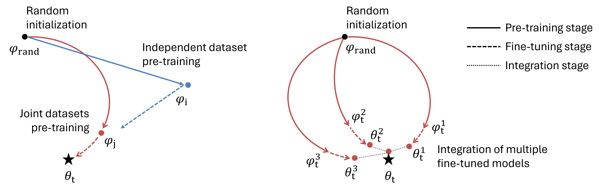

# TSTL 

[![CC BY-NC-SA 4.0][cc-by-nc-sa-shield]][cc-by-nc-sa] (free for academic use) 

A Task-Specific Transfer Learning Approach to Enhancing Small Molecule Retention Time Prediction with Limited Data

<p align="left">
  
</p>

## Set up

**Step 1**: Establish anaconda environment

```bash
conda env create -f environment.yml
conda activate molnet
```

We used PyTorch 1.13.1 with CUDA 11.7 during our experiments. Please use the appropriate versions for your device. 

**Step 2**: Download datasets

```bash
git clone https://github.com/michaelwitting/RepoRT.git
```

**Step 3**: Data preprocessing

```bash
python preprocess.py
```

The preprocessing results are: 

```bash
...
====================
manually_removed: 29
too_few_samples: 342
missing_rt_data: 4
pretrain: {'0390': 1, '0391': 2, '0186': 0}
benchmark: 6
explore: 36
success: 42
====================
Done.
```

## Pre-train and fine-tune

**Step 1**: Pre-training stage: 

```bash
python run_tstl_pretrain.py \
--train_task_paths ./data/benchmark/0063_rt_train.csv \
--pretrain_task_path ./data/raw_all/pretrain_0_rt.csv \
--valid_task_paths ./data/benchmark/0063_rt_valid.csv \
--model_config ./config_pretrain.yml \
--checkpoint_path ./checkpoint/0063_pre0.pt \
--device 1

python run_tstl_pretrain.py \
--train_task_paths ./data/benchmark/0063_rt_train.csv \
--pretrain_task_path ./data/raw_all/pretrain_1_rt.csv \
--valid_task_paths ./data/benchmark/0063_rt_valid.csv \
--model_config ./config_pretrain.yml \
--checkpoint_path ./checkpoint/0063_pre1.pt \
--device 1

python run_tstl_pretrain.py \
--train_task_paths ./data/benchmark/0063_rt_train.csv \
--pretrain_task_path ./data/raw_all/pretrain_2_rt.csv \
--valid_task_paths ./data/benchmark/0063_rt_valid.csv \
--model_config ./config_pretrain.yml \
--checkpoint_path ./checkpoint/0063_pre2.pt \
--device 1
```

**Step 2**:  Fine-tuning stage: 

```bash
python run_tstl_finetune.py --data ./data/benchmark/0063_rt_valid.csv \
--model_config ./config_finetune.yml \
--pretrained_paths ./checkpoint/0063_pre0.pt ./checkpoint/0063_pre1.pt ./checkpoint/0063_pre2.pt \
--checkpoint_paths ./checkpoint/0063_ft0.pt ./checkpoint/0063_ft1.pt ./checkpoint/0063_ft2.pt \
--ensemble_path ./checkpoint/0063_ensemble.pt \
--result_path ./result/0063_results.csv 

# Running fine-tuning from 3 pre-trained models in parallel: 
python run_tstl_finetune.py --data ./data/benchmark/0063_rt_valid.pkl \
--model_config ./config_finetune.yml \
--pretrained_paths ./checkpoint/0063_pre0.pt ./checkpoint/0063_pre1.pt ./checkpoint/0063_pre2.pt \
--checkpoint_paths ./checkpoint/0063_ft0.pt ./checkpoint/0063_ft1.pt ./checkpoint/0063_ft2.pt \
--ensemble_path ./checkpoint/0063_ensemble.pt \
--result_path ./result/0063_results.csv \
--parallel \
--log_dir ./log/
```

<!-- ## TODO

- [x] make them running in parallel
- [x] handle the logs
- [ ] support of GNN, GIN, MPNN -->

## Citation

The manuscript will be published shortly. 

## License

This work is licensed under a
[Creative Commons Attribution-NonCommercial-ShareAlike 4.0 International License][cc-by-nc-sa].

[![CC BY-NC-SA 4.0][cc-by-nc-sa-image]][cc-by-nc-sa]

[cc-by-nc-sa]: http://creativecommons.org/licenses/by-nc-sa/4.0/
[cc-by-nc-sa-image]: https://licensebuttons.net/l/by-nc-sa/4.0/88x31.png
[cc-by-nc-sa-shield]: https://img.shields.io/badge/License-CC%20BY--NC--SA%204.0-lightgrey.svg
